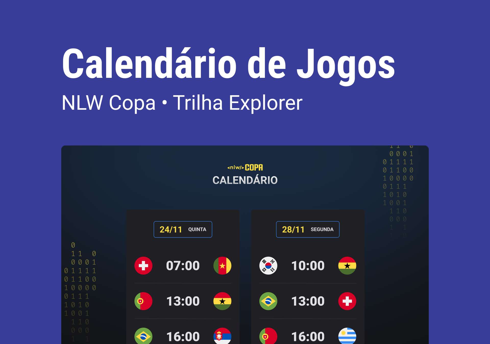

<h1 align="center">NLW 10 - World Cup Event</h1>

Evento exclusivo e gratuito, promovido pela Rocketseat para ensino de tecnologias WEB.

 

<a target="_blank" href="https://www.figma.com/file/4nvgKu7XziR90zsXcPyAtL/Calend%C3%A1rio-de-Jogos-(Community)?node-id=175%3A1815">Layout do projeto</a>

Tecnologias utilizadas:
 HTML e CSS
 Javascript
 Git e GitHub

